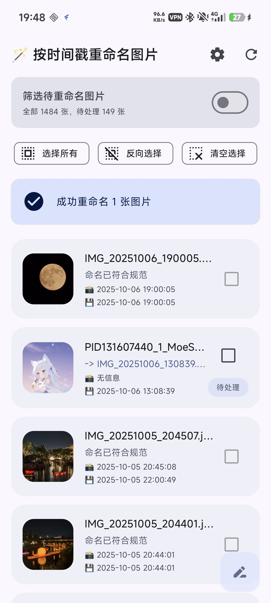
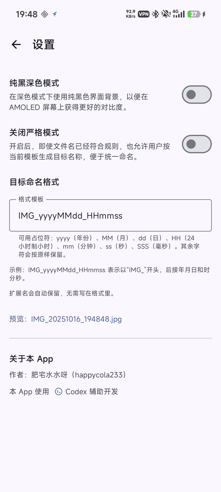
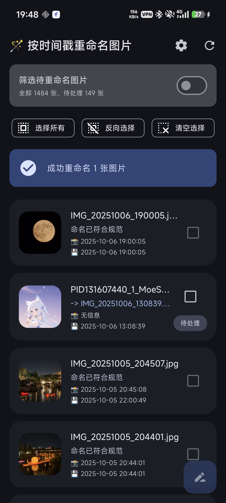
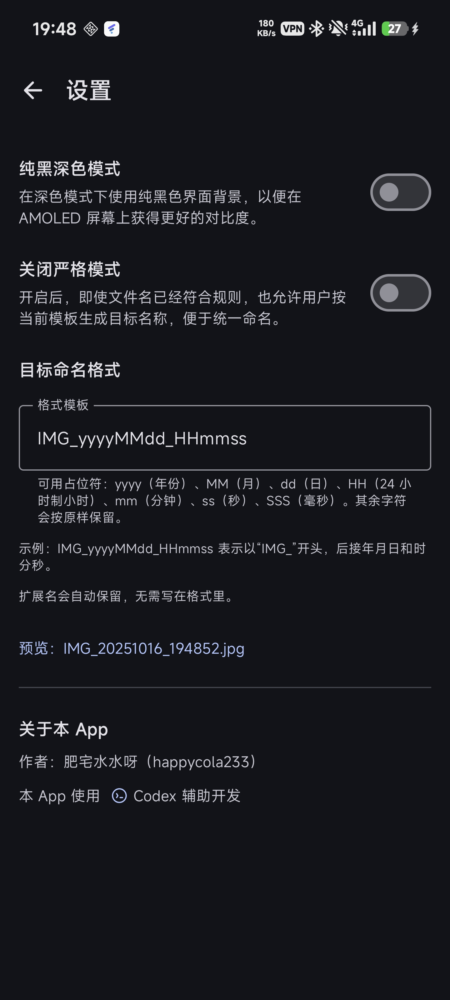
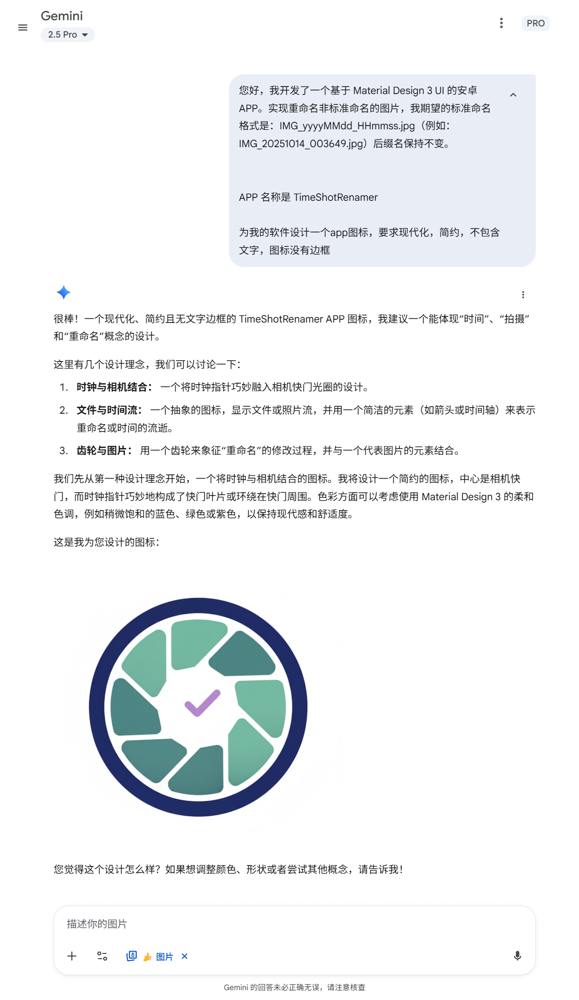

# 📸 时间戳图片命名器 · TimeShot Renamer

> 你是否在为从其他 APP 保存的图片命名毫无规则而困扰？本 APP 可以批量按 **拍摄时间** 统一重命名你的照片，快速获得整洁、可排序的图库。

<p align="left">
  
  
  
  
  
</p>

## ✨ 特性

- 👀 **实时预览与即时校验**：逐条展示缩略图、拍摄/保存时间、当前名称与目标名称；模板错误会即时提示。
- ⚡ **高效批量管理**：支持 **全选**、**反选**、**清空选择**，以及「仅显示不合规项」。悬浮按钮统计待处理数量并在执行时显示进度。
- 🧩 **灵活命名模板**：默认  `IMG_yyyyMMdd_HHmmss`，支持  `yyyy / yy / MM / dd / HH / mm / ss / SSS`  占位符与自定义字面量，附示例预览。
- 🎛️ **可控重命名策略**：启用 **关闭严格模式（Force Rename）** 后，即便文件名已经符合规则，也允许用户按命名模板生成目标名称，便于统一命名。
- 🔐 **符合 Scoped Storage**：通过 `MediaStore.createWriteRequest` 获得系统授权，在 Android 10+ 下合规地批量修改文件名。
- 🔁 **自动去重**：同批次生成的重复目标名会自动追加 `_01`、`_02`…，避免系统拒绝或误覆盖。
- 🌙🖤 **深色适配**：可选纯黑深色背景，友好于 OLED 设备。

> 💡 本项目仅对**文件名**进行改动，不触碰文件内容。


## 🖼️ 软件截图

> 以下截图展示了 TimeShot Renamer 在浅色与深色模式下的主要界面：

<p align="center">
  
  
</p>

<p align="center">
  
  
</p>


## 🤖 本项目的所有代码全部由 AI 生成！

可能您无法相信，但是本项目 **从 0 开始的所有代码** 均由 **OpenAI Codex** 生成与迭代完成。下面附上部分 *Prompt to Codex* 片段，便于了解需求与实现的来龙去脉：

```markdown
您好，我现在想开发一个基于 Material Design 3 UI 的安卓 APP。实现重命名非标准命名的图片，我期望的标准命名格式是：IMG_yyyyMMdd_HHmmss.jpg（例如：IMG_20251014_003649.jpg）后缀名保持不变。APP 应当正确读取图片的 Exif 信息（注意时区问题），要能够让用户自己多选图片，并显示预览重命名后的效果。支持过滤筛选出不符合标准命名的图片（开关）

---

不要调用系统相册选择器，直接读取所有相册内容，自建时间顺序的照片流

---

在原有规则基础上，只要文件名包含：`yyyyMMdd_HHmmss` 或包含 `yyyy-MM-dd` 的都被认为是无需重命名

---

对于没有办法获取到exif拍摄时间的，应当显示为文件保存时间，保存时间区别于拍摄时间，对于每一张照片，同时显示拍摄时间和保存时间

---

有拍摄时间的时候优先使用拍摄时间重命名。在图片显示列表中，如果没有拍摄时间，不要显示“拍摄日期（使用保存时间）”，直接显示“拍摄日期：无信息”

---

当前选中项会有一个很粗的边框（紧贴文字元素的边框），请删掉，选中的时候只要那个圆角矩形的边缘加粗就可以了

---

现象：在“按时间重命名图片”页，勾选任意条目后，整张卡片（缩略图、文字区、右侧勾选框）外围会出现一圈明显偏粗、颜色较深的边框/描边。该边框与未选中态风格不一致，圆角也与卡片不匹配，视觉上外扩且部分遮挡内容。滚动列表时该边框持续存在，多选时每个被选中项都如此；取消勾选后消失。
期望：选中态应保持轻量化，不影响内容与圆角一致性，仅这个条目加边框就行了
提醒：请不要默认只是把某个 border/stroke 数值改细就能解决，这个粗边框可能由多种原因触发，请根据现象自行推理并提出修复方案。

---

很棒！下面我们进行进一步的优化：
1. 在右上角刷新按钮的左边再加一个设置按钮
2. 新增设置页面：
   包括的功能开关有：
   - 深色模式是否使用纯黑背景（默认关闭）
   - 允许用户自定义目标命名格式，默认值就是现在的“IMG_yyyyMMdd_HHmmss”，并且提示用户时间格式是怎么写的，说明yyyyMMdd_HHmmss的含义
```

**APP 图标设计**：由 *Gemini* 设计（含设计理念与讨论记录）：




> 为了迎合视觉上指针处于中心的平衡位置，图标中的时钟指针位置做了轻微偏移。

<p align="center">
  
</p>


---

基于以上真实协作过程，下面是更完整的亲身感想。


## 💭 开发者感想 · About AI Coding

这个项目对我而言，是一次令人震撼的体验——**从 0 到 1 的所有开发工作，均由 OpenAI Codex 完成**。
我只负责提出构思、编写提示语（Prompt）并验证运行结果，而 Codex 完成了从架构设计、UI 构建、逻辑实现到优化调试的全部过程。

在过去，AI 再强大似乎也只能胜任单文件程序的编写。
对于像 Android 应用这种拥有复杂结构目录、多个模块、跨文件依赖的项目，AI 往往无从下手。
但如今，Codex 的理解力和代码组织能力已经**突破了这一瓶颈**——它能在多文件项目中保持逻辑一致性、引用正确性以及风格统一性。
可以说，这标志着 AI 从“会写代码”迈向了“会构建系统”的时代。

在过去，开发这样一个功能完备、界面精致、逻辑清晰的 Android 应用往往需要花费数周时间。
然而这一次，**整个项目只用了 1 天时间就完成**，几乎每一次生成都能直接运行。
更令人惊叹的是——

> **Codex 太强了！**
> 在过去的一个月内，它的版本更新让迭代速度从平均 25 分钟一轮缩短到仅 8 分钟一轮。
> 每一次迭代结束后，代码几乎都能立即编译运行，偶尔的错误只需一两次调试便能完美修复。
> 这种高效与准确的程度，让我感到震惊与欣喜！🎉

这一切让我第一次真正感受到 **AI 辅助开发的潜能**。
Codex 不再只是一个“写代码的机器”，它能理解上下文、分析需求、生成结构良好的可维护代码，甚至在样式与交互上保持一致性。

> **AI 正在改变我们与代码的关系**——
> 它不再只是执行命令的工具，而是一个可以沟通、理解、共同创造的智能伙伴。

我由衷感受到自然语言编程的魅力：**思维与实现之间的距离，正在被彻底消除。**
未来的开发者，或许不再为语法与框架困扰，而将更多专注于创意、体验与逻辑思维。
繁琐的细节与重复劳动，终将交给 AI 去处理。

这并不是“AI 取代人类”，而是 **人机共创（Human-AI Co-Creation）** 的开端。
AI 让我们更快地实现灵感，也让我们重新认识“创造力”的边界。
我真心为这股力量的成长速度感到激动与敬畏，
并期待在不远的未来，看到更多人类与 AI 共同完成的作品。🚀


## 🧠⚙️ 命名规则与工作原理

### 🔤 命名模板占位符

| 占位符   | 含义                   | 示例输出 |
| -------- | ---------------------- | -------- |
| `yyyy` | 四位年份               | `2024` |
| `yy`   | 两位年份               | `24`   |
| `MM`   | 月份（01-12）          | `08`   |
| `dd`   | 日期（01-31）          | `15`   |
| `HH`   | 24 小时制小时（00-23） | `21`   |
| `mm`   | 分钟（00-59）          | `33`   |
| `ss`   | 秒（00-59）            | `07`   |
| `SSS`  | 毫秒（000-999）        | `245`  |

- 模板中的非占位符字符会按字面值输出。例如：`Photo-'yyyyMMdd'` → `Photo-20240101`。
- 系统会自动为模板中的**单引号**做转义，无需手动包裹。

### ⏱️ 时间来源优先级

1. EXIF `TAG_DATETIME_ORIGINAL` / `TAG_SUBSEC_TIME` / `TAG_OFFSET_TIME`
2. `MediaStore.Images.Media.DATE_TAKEN`（毫秒）
3. `MediaStore.Images.Media.DATE_MODIFIED`（秒）

> 若无法获取有效时间戳，条目会标记为「未知」并保持不可重命名。

### ✅ 合规性判定

- 若文件名已包含 `yyyyMMdd` 或 `yyyy_MM_dd` 日期，视为具备时间信息。
- 当目标名与现有文件名仅大小写或扩展名大小写有差异时，视为已合规。
- 在默认模板下，若文件名包含 `yyyyMMdd_HHmmss`、`yyyy-MM-dd-HH-mm-ss-*` 或 `yyyy-MM-dd`，亦视为已具备时间戳（除非启用 **关闭严格模式**）。
- 启用**关闭严格模式**后，所有条目都会生成目标名称；若当前名称与目标名称完全一致，会标记 `matchesTargetName` 以便确认模板效果。

### 🧯 冲突与失败处理

- 使用不区分大小写的映射表追踪目标名称，出现重复时为第二个及后续条目自动追加 `_NN` 序号。
- 重命名失败（系统拒绝/文件占用等）会在卡片上显示失败状态与异常信息，并在摘要中统计失败数量。
- 批量操作依赖系统授权弹窗；若用户取消或被系统拒绝，将回滚为「待处理」状态并提示原因。

## 📲 安装与使用

1. **安装应用**：在 `app/release/` 获取 `arm64-v8a` APK（可 `adb install` 或通过文件管理器安装）。需要全量包可用 Android Studio 通过 `assembleDebug` 构建。
2. **授予权限**：首次启动需授予 `READ_MEDIA_IMAGES`（Android 13+）或 `READ_EXTERNAL_STORAGE`（Android 10–12）以扫描图库。
3. **刷新媒体库**：右上角刷新或长按空状态卡片重新扫描；按拍摄时间倒序展示。
4. **查看建议**：卡片展示现有名、目标名、时间与状态；可开启「仅不合规项」筛选。
5. **选择条目**：点按/长按选择；底部芯片提供「选择所有待处理」「反向选择」「清空选择」。
6. **执行重命名**：点击浮动按钮 → 系统授权弹窗 → 确认后批量改名并给出成功/失败摘要。
7. **调整设置**：右上角进入设置，修改模板、恢复默认、切换关闭严格模式与纯黑深色。

> 🧾 **默认模板命名格式模板**：`IMG_yyyyMMdd_HHmmss`

## ⚙️ 设置项

- **目标命名格式**：实时校验模板合法性；非法模板会阻止批量重命名并显示错误信息。
- **恢复默认格式**：一键恢复 `IMG_yyyyMMdd_HHmmss`。
- **关闭严格模式（Force Rename）**：忽略合规性检查，对所有条目生成目标名称，便于统一大小写或扩展名。
- **纯黑深色模式**：在系统深色主题下采用纯黑背景。

## 📱🔒 权限与兼容性

- **最低支持**：Android 10（API 29）
- **目标版本**：API 36
- **权限**：仅请求读取媒体库权限；重命名通过 `MediaStore.createWriteRequest` 的系统级授权完成。

## 🗂️ 项目结构

```text
TimeShotRenamer/
├─ app/
│  ├─ src/main/java/com/happycola233/TimeShot/renamer/
│  │  ├─ MainActivity.kt                # 入口：挂载 Compose 界面
│  │  ├─ MediaRenameViewModel.kt        # 核心：媒体扫描、命名建议、批量重命名
│  │  ├─ PhotoRenamerScreen.kt          # 主界面：列表、筛选、选择、状态
│  │  ├─ SettingsScreen.kt              # 设置页：模板与模式
│  │  └─ ui/theme/                      # 主题、色板、Typography
│  ├─ src/main/res/                     # 字符串、图标、SVG 等
│  ├─ src/test/                         # JVM 单测占位
│  └─ build.gradle.kts                  # 模块构建配置
├─ build.gradle.kts                     # 根构建配置
├─ gradle/                              # Gradle Wrapper (8.13)
└─ Dev_Files/                           # 设计提示与素材
```

## 🛠️📦 构建与发布

> 建议环境：Android Studio **Jellyfish 或更高**（AGP 8.6+）、Gradle Wrapper **8.13**、**JDK 17+**。

- **调试构建**
  ```bash
  ./gradlew assembleDebug
  # Windows:
  gradlew.bat assembleDebug
  ```
- **发布 AAB**
  ```bash
  ./gradlew bundleRelease
  ```
- **快速语法检查（Compose 编译）**
  ```bash
  ./gradlew :app:compileDebugKotlin
  ```

**Release 构建**启用 R8 混淆与资源收缩，并按 ABI（`arm64-v8a`）与屏幕密度输出拆分 APK（位于 `app/release/`）。如需通用 APK，可在 `app/build.gradle.kts` 的 `splits` 中启用 `isUniversalApk = true` 或移除密度拆分。

> 项目未内置签名。正式分发前请在 `gradle.properties` 或 `~/.gradle/gradle.properties` 配置签名信息。

## 🧪 测试与质量

- **JVM 单元测试**（建议覆盖：EXIF 解析、正则匹配、命名冲突处理）
  ```bash
  ./gradlew testDebugUnitTest
  ```
- **Compose/Espresso 仪器测试**（需连接设备或模拟器）
  ```bash
  ./gradlew connectedDebugAndroidTest
  ```
- **Lint 检查**
  ```bash
  ./gradlew lint
  ```

## ❓ 常见问题

**Q：为什么重命名时会有系统授权弹窗？**
A：Android 10+ 的 Scoped Storage 要求通过 `MediaStore.createWriteRequest` 修改外部存储中的媒体文件名，系统弹窗用于保护用户数据与操作可追溯性。

**Q：为何某些图片没有生成目标名称？**
A：若无法从 EXIF、`DATE_TAKEN`、`DATE_MODIFIED` 得到有效时间戳，或文件名已判定合规，则不会生成建议。可尝试启用**关闭严格模式**或手动补全时间信息。

## 📄 许可证

本项目基于 **MIT License** 许可发布。
